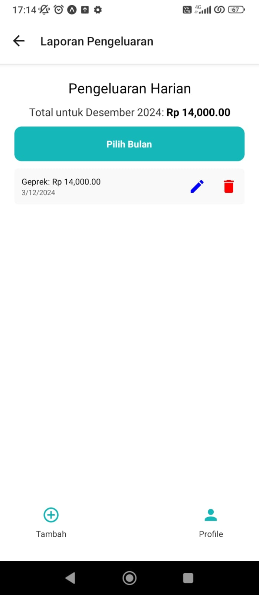
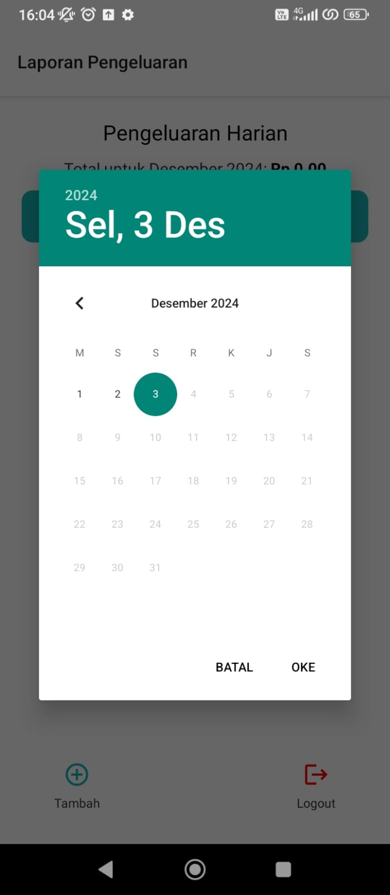
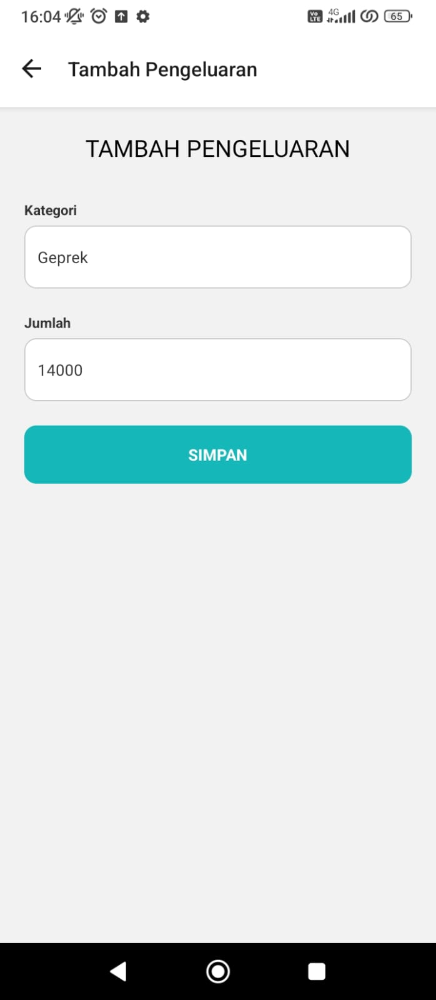
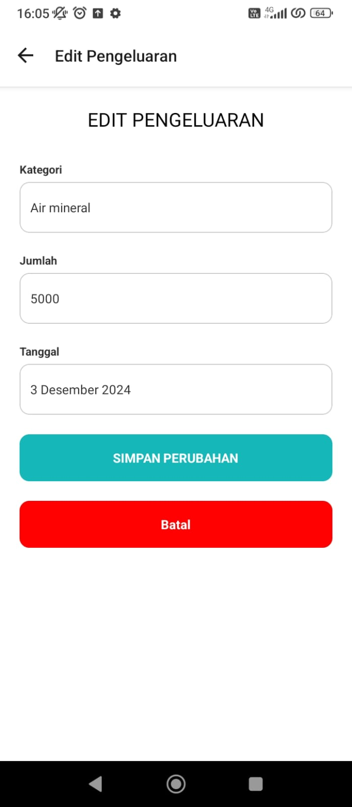

# 📱 Pencatat Keuangan Harian  

**Pencatat Keuangan Harian** adalah aplikasi mobile sederhana yang dirancang untuk membantu pengguna mencatat, mengelola, dan melacak pengeluaran harian mereka. Aplikasi ini memungkinkan pengguna untuk memahami dan mengontrol kebiasaan finansial dengan lebih baik.  

---

## ✨ Fitur Utama  
- **📋 Pencatatan Pengeluaran**  
  Catat pengeluaran harian Anda dengan kategori, jumlah, dan tanggal yang terstruktur.  

- **📅 Laporan Bulanan**  
  Lihat total pengeluaran bulanan yang ditampilkan dalam format mata uang dengan pemisah ribuan (contoh: Rp 1.000).  

- **✏️ Edit dan Hapus Pengeluaran**  
  Kelola data yang telah dicatat dengan fitur edit dan hapus.  

- **🗓️ Pilih Bulan**  
  Fitur untuk memilih bulan tertentu guna melihat ringkasan pengeluaran.  

- **🔒 Logout**  
  Amankan data Anda dengan fitur logout.  

---

## ⚙️ Teknologi yang Digunakan  
- **React Native Expo**: Untuk pengembangan lintas platform (iOS & Android).  
- **AsyncStorage**: Untuk penyimpanan data lokal pengguna.  
- **Moment.js**: Untuk memformat dan menampilkan tanggal.  

---

## Screenshots AppReport

